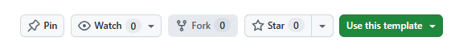

# Telepulse — 텔레그램 주식방 아침 브리핑

구독 중인 텔레그램 주식방들의 **지난 24시간을 하나로 정리해서**, 매일 아침 내 텔레그램
'저장된 메시지'로 보내줍니다. 방이 열 곳이든 스무 곳이든 아침에 읽을 것은 4통뿐입니다.

> **컴퓨터에 설치하는 것이 없습니다.**
> 브라우저에서 설정 화면이 열리고, 설정이 끝나면 창을 닫으면 됩니다.
> 내려받는 파일도, 실행하는 프로그램도 없습니다.

---

## 1. 무엇을 받게 되나

매일 아침, 텔레그램 **'저장된 메시지'** 로 브리핑 4통이 옵니다.

| 통 | 내용 |
|---|---|
| 1 | **오늘의 핵심 테마 3개** — 개별 뉴스가 아니라 여러 뉴스를 꿰는 축 |
| 2 | **여러 방이 동시에 다룬 종목** — 사실과 해석을 나눠서 |
| 3 | **해외 뉴스·글로벌 증시** — 국내 어느 업종에 어떻게 영향인지 |
| 4 | **정리와 관찰 대상** — 그리고 과열·루머 경고 |

<!-- 스크린샷 자리: 실제 브리핑을 캡처해 distribution/docs/sample.png 로 넣고,
     release.py 의 INCLUDE 에 그 파일을 추가한 뒤 아래 한 줄의 주석을 푼다.
     화이트리스트에 넣지 않으면 배포본에 파일이 없어 깨진 이미지가 뜬다.
     방 이름이 보이지 않게 가린 뒤 넣을 것. -->
<!--  -->

**가장 중요한 신호는 "여러 방이 동시에 말한 것"입니다.** 한 방에서만 나온 이야기와
네 방이 같이 떠든 이야기를 구분해서, 후자를 앞에 놓습니다.

---

## 2. 먼저 준비할 것 3개

이 셋은 본인이 직접 만들어야 합니다. 프로그램이 대신할 수 없습니다. (합쳐서 10~15분)

| 준비물 | 어디서 | 왜 필요한가 |
|---|---|---|
| 텔레그램 **API ID / API HASH** | `my.telegram.org` | 내가 구독한 방의 글을 읽어오기 위해서입니다. 봇이 아니라 내 계정으로 붙기 때문에 남이 대신 읽어줄 수 없습니다 |
| **GitHub 계정** | `github.com` | 매일 아침 실행을 GitHub가 대신 해줍니다. 내 PC를 켜둘 필요가 없습니다 |
| **OpenAI API 키** + 카드 등록 | `platform.openai.com` | 요약을 하는 AI 사용료입니다. 본인 카드로 결제됩니다 |

**⚠️ `my.telegram.org` 로그인 코드는 문자(SMS)가 아니라 텔레그램 앱 안으로 옵니다.**
문자를 기다리지 마세요. 텔레그램 앱을 열고 `Telegram` 이라는 이름의 공식 채팅을 확인하세요.

**⚠️ OpenAI 키는 만든 직후 한 번만 보입니다.** 창을 닫으면 다시 볼 수 없으니 그 자리에서
복사해 두세요. 그리고 **카드를 먼저 등록**해야 키가 작동합니다.

---

## 3. 시작하기 — 4단계

### ① 이 저장소를 내 계정으로 복사합니다

이 페이지 **오른쪽 위**의 초록색 **`Use this template`** → **`Create a new repository`** 를 누릅니다.

| 📷 아래는 화면을 찍은 **그림**입니다 — 눌러도 반응하지 않습니다 |
| :--- |
|  |

- 이름은 아무거나 (예: `my-telepulse`)
- **반드시 `Private`(비공개)을 고릅니다.** 내가 어떤 방을 구독하는지가 이 저장소에 저장됩니다

### ② 설정 화면을 띄웁니다

복사된 **내 저장소**에서 초록색 **`Code ▾`** 버튼 → **`Codespaces`** 탭 →
**`Create codespace on main`**.

`Code ▾ → Codespaces` 안에 여러 항목이 보이지만 **쓸 것은 하나뿐입니다.**

| 항목 | 쓰나 |
|---|---|
| `Create codespace on main` / 목록의 이름 클릭 | **이것만 쓰면 됩니다** |
| `Open in VS Code` / `Open in JupyterLab` | 무시 |
| `Change machine type` / `Configure dev container` | 무시 |

### ③ 1~2분 기다립니다

브라우저에 검은 화면(코드 편집기)이 뜨고, 아래쪽에 준비 중이라는 글자가 빠르게 지나갑니다.
끝나면 **설정 화면이 새 브라우저 탭으로 자동으로 열립니다.**

> **열리지 않으면 → 4절**을 보세요. 흔히 있는 일이고 5초면 해결됩니다.

### ④ 설정 화면에서 값을 넣습니다

| 단계 | 하는 일 |
|---|---|
| 1 | 준비한 **API ID / API HASH** 붙여넣기 |
| 2 | **전화번호 → 인증코드** (2단계 인증을 켜뒀으면 비밀번호까지) |
| 3 | **수집할 방 고르기** — 고를 때마다 예상 비용이 옆에서 바뀝니다 |
| 4 | **OpenAI 키** 붙여넣기 → `저장하고 시작하기` |

**⚠️ 2단계의 인증코드도 문자가 아니라 텔레그램 앱으로 옵니다.**
그리고 이것은 ①에서 `my.telegram.org` 에 로그인할 때 쓴 코드와 **서로 다른 코드**입니다.
코드를 두 번 받는 것이 정상입니다.

저장이 끝나면 `준비됐습니다` 화면이 나옵니다. **창을 닫으면 끝입니다.**

### ⚠️ 설정 화면은 GitHub 페이지에 없습니다

저장소 첫 화면(파일 목록이 보이는 곳)에서 설정 화면을 찾으면 안 나옵니다.
**항상 Codespace를 거쳐야** 합니다.

```
내 저장소 첫 화면 (github.com/…)
      │  Code ▾ → Codespaces
      ▼
브라우저 안의 코드 편집기 (Codespace)
      │  자동으로 새 탭이 열림 (또는 [포트] 탭의 8765)
      ▼
설정 화면  ← 여기가 값을 넣고 방을 고르는 곳
```

---

## 4. 설정 화면이 자동으로 열리지 않으면

세 번 중 한두 번은 자동으로 안 열립니다. **아래 순서대로** 하세요.

### ① `포트` 탭에서 엽니다 — 대부분 이걸로 끝납니다

Codespace 화면 아래쪽 패널에서 **`포트`(PORTS)** 탭을 누릅니다.
`8765` 줄에 마우스를 올리면 **지구본 아이콘 🌐** 이 나옵니다. 그것을 누릅니다.

### ② `8765` 줄이 아예 없을 때만 — 터미널에 한 줄

아래쪽 **`터미널`(TERMINAL)** 탭에 입력하고 Enter:

```bash
python setup/server.py
```

`설정 화면은 이미 실행 중입니다` 라고 나오면 **정상입니다.** 다시 켤 필요가 없다는 뜻이니
①로 돌아가세요.

### ③ 그래도 안 되면 — Codespace를 지우고 다시 만듭니다

`Code ▾ → Codespaces` 목록에서 `⋯` → `Delete` → 다시 `Create codespace on main`.

> **이건 최후의 방법입니다.** ①②로 거의 다 해결됩니다.
> 그리고 **설정을 다 마친 뒤에는 지우지 마세요** — 6절을 보세요.

---

## 5. 비용 — 본인 카드로 청구됩니다

| 항목 | 금액 |
|---|---|
| AI 요약료 (OpenAI) | **월 약 2~3만원** · 본인 카드 |
| GitHub · Codespace | 개인 계정 무료 사용량 안에서 끝납니다 |

**비용은 방 개수가 아니라 글의 양으로 정해집니다.** 조용한 방 열 곳보다 수다스러운 방
한 곳이 더 비쌉니다. 그래서 설정 화면 3단계에서 **방을 고를 때마다 금액이 실시간으로 바뀝니다.**
그 숫자를 보고 결정하세요.

설정을 마친 뒤 `지금 한 번 만들어보기`를 누르면 **그 자리에서 약 800원이 추가로** 나갑니다.
내일 아침을 기다려도 되고, 지금 확인하고 싶으면 눌러도 됩니다.

---

## 6. 나중에 방을 바꾸고 싶을 때

**Codespace를 지우지 마세요.** 남겨두면 다음에 10~20초면 열립니다.

**이 주소를 즐겨찾기 해두세요** — 다시 찾아오는 가장 빠른 길입니다.

```
github.com/<내계정>/<내저장소>/codespaces
```

- 목록에 있는 **이름을 클릭**하면 다시 켜집니다 (10~20초)
- 목록이 비어 있으면 `Create codespace on main` (1~3분)
- Codespace 설정에서 **`Auto-delete codespace` 체크를 꺼두면** 더 오래 남습니다
- 기본 설정에서 30분쯤 손대지 않으면 자동으로 멈춥니다. 요금이 계속 쌓이지 않습니다

### 두 가지 경우가 다릅니다

| 하려는 것 | 텔레그램 재로그인 |
|---|---|
| **이미 있는 방을 켜고 끄기** | 필요 없습니다 |
| **새로 가입한 방 찾기** | **다시 로그인해야 합니다** |

로그인 정보는 GitHub 금고(Secrets)에 **넣을 수만 있고 꺼내볼 수 없기** 때문입니다.
그리고 **새로 가입한 방은 항상 꺼진 상태로** 들어옵니다 — 새로 들어간 가족방·회사방 내용이
본인이 모르는 사이에 AI로 넘어가는 일을 막기 위해서입니다. 직접 켜야 수집됩니다.

---

## 7. 막혔을 때

| 증상 | 이렇게 하세요 |
|---|---|
| **인증코드가 문자로 안 온다** | 문자가 아니라 **텔레그램 앱 안**으로 옵니다. `Telegram` 이라는 공식 채팅을 확인하세요 |
| **코드를 두 번 받으라고 한다** | 맞습니다. `my.telegram.org` 로그인 코드와 설정 2단계의 인증코드는 **서로 다른 코드**입니다 |
| **OpenAI 키가 안 먹는다** | **카드를 먼저 등록**해야 작동합니다. 그리고 키는 만든 직후 한 번만 보이므로, 잃어버렸으면 새로 만드세요 |
| **자동 실행이 안 켜졌다** | 내 저장소 **`Actions`** 탭 → `I understand my workflows, go ahead and enable them` 버튼을 한 번 누르면 됩니다 |
| **회사 컴퓨터에서 안 된다** | Codespace(클라우드)에서 열면 됩니다. 회사망에서 텔레그램이 막혀 있어도 무관합니다. 다만 **내 PC에서 직접 실행하는 방법은 회사망에서 작동하지 않습니다** |

설정 화면이 열리지 않는 문제는 **4절**에 따로 있습니다.

---

## 8. 알아둘 것 3개

### ① 도착 시각은 조금씩 다릅니다

매일 아침 8시에 자동으로 돌기 시작합니다. 다만 그날 처리할 양과 서버 사정에 따라
요약이 완성되는 시각이 달라지므로, 언제 도착할지를 딱 정해 말씀드리기는 어렵습니다.
보통은 8시 반 전후로 오지만, 때에 따라 장이 열린 뒤에 올 수도 있습니다.

읽어오는 구간은 아침 8시를 기준으로 고정돼 있습니다. 그래서 도착이 늦어도
읽는 범위는 그대로이고, 내용이 빠지지는 않습니다.

### ② 저장소는 **반드시 비공개(Private)** 로 두세요

내가 어떤 방을 구독하는지가 저장소에 저장됩니다. 텔레그램 로그인 정보도 이 저장소의
금고에 들어갑니다. 공개로 바꾸지 마세요.

### ③ 투자 판단 **보조 자료**입니다 — 매매 신호가 아닙니다

입력이 검증되지 않은 텔레그램 메시지입니다. 루머와 광고가 섞여 들어옵니다.
AI가 루머를 루머로 표시하려고 하지만 완벽하지 않습니다. **읽고 판단하는 것은 본인입니다.**

---

## 내부는 어떻게 돌아가나

```
매일 오전  GitHub Actions 가 알아서 실행
   │
   ├ 1. 고른 방들의 지난 24시간 메시지를 모읍니다
   ├ 2. 같은 글이 여러 방에 퍼진 것을 코드가 묶고 셉니다
   ├ 3. AI가 하루에 딱 한 번 호출돼 전체를 요약합니다
   └ 4. 내 텔레그램 '저장된 메시지'로 4통 전송
```

"몇 개 방에서 언급됐나"는 **AI가 아니라 코드가 셉니다.** 그래서 브리핑에 적힌 방 개수는
지어낸 숫자가 아닙니다.

코드는 전부 내 저장소 안에 있고 전부 내 것입니다. `prompts.py` 를 열어 관심 업종을
바꿔 써도 됩니다 — 고장이 아니라 원래 그렇게 쓰는 파일입니다.
